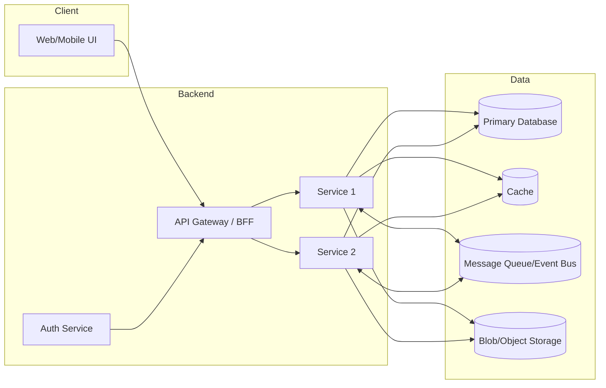
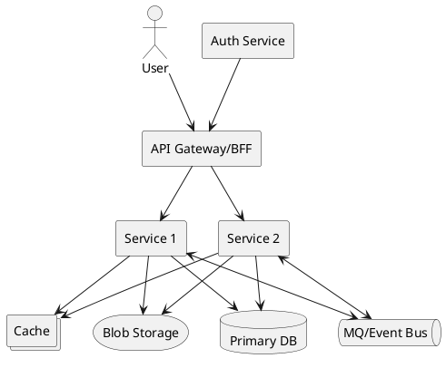
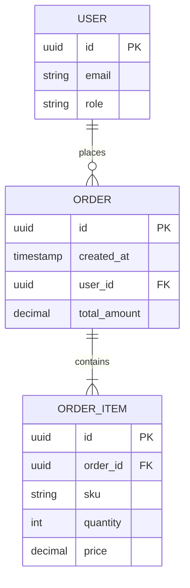
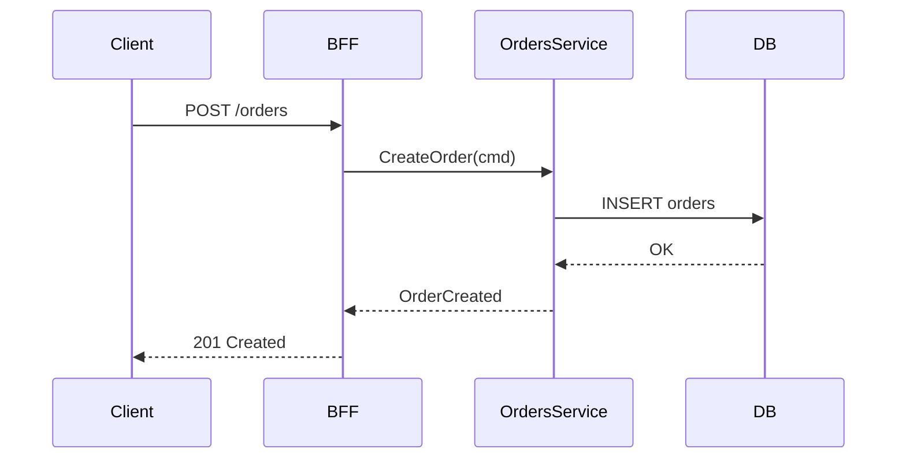

**Role:** Senior Software Architect & Technical Writer (Turkish).  
**Instruction:** Thoroughly analyze the **PRD file** I have attached and **this project** (repo tree, source code, configurations, IaC, CI/CD scripts, API contracts, etc.) and generate a single file named **architecture.md**.

---

## Purpose
To document the architectural state of the project in a clear, consistent, and auditable manner based on the existing code and PRD. The document should cover system components, data model, integrations, security and operational considerations, scalability and resilience tactics, testing/CI-CD strategy, and future evolution plans.

## Output Rules
- **File:** Provide only the content of **`architecture.md`**. Do not produce any other explanations, preface, or additional output.
- **Language/Tone:** Turkish; formal but understandable. Use short paragraphs, bullet points, and tables where necessary.
- **Target length:** ~1,500–3,000 words (flexible as needed).
- **References:** Use actual file/directory paths (e.g., `/api/openapi.yaml`, `/deploy/helm/values.yaml`, `/infrastructure/terraform`, `/src/**/application.yml`, `/docs/ADR-001.md`).
- **Diagrams:** Provide executable **Mermaid** code blocks; add **PlantUML** alternatives where appropriate.
- **Transparency:** Clearly indicate missing/inconsistent points in the **Assumptions** and **Open Questions/TBD** sections.
- **Source of truth:** Code and repo artifacts represent the “actual state.” If you see a difference with the PRD, flag it and document the implications.

## Method (Internal Process Expectations)
- Extract **business objectives**, **scope**, **critical user flows**, and **quality attributes** (performance, security, scalability, observability, resilience) from the PRD.
- Collect artifacts reflecting the architecture from the repo tree: API contracts (OpenAPI/GraphQL/AsyncAPI), **Docker/Helm**, **Terraform/Pulumi**, **CI/CD** scripts (GitHub Actions/GitLab CI), **config files**, **ADRs**, domain packaging, modules/services.
- Automatically diagnose **microservices or monoliths**; provide details accordingly in sections.
- Create a **Requirement → Component traceability** table.
- Be sure to fill in the **Security, data privacy, config management, observability, CI/CD**, and **testing** sections.
- In the last section, provide **Risks & Trade-offs** and the **Future Evolution Plan**.

---

## `architecture.md` — Content Template (Fill in)

# Architecture Overview
- **Short Summary:** Project purpose, target users, core value proposition.
- **Scope:** What this document covers/does not cover.
- **Context:** Summary of main use cases and business objectives from the PRD.

## Requirements → Component Mapping
Fill in the table below based on the PRD and repo findings:
| PRD requirement | Component/Module | Related file/path | Validation method/test |
|---|---|---|---|

## High-Level Architecture
Show the system's high-level components and interactions:

> (Optional) PlantUML version of the same diagram:

## Components and Responsibilities
For each component: responsibilities, inputs/outputs, main classes/packages, key configurations, state management, and error strategies.
- **API Gateway/BFF:** … (e.g., `/cmd/bff`, `/apps/bff`)
- **Service/Module X:** … (e.g., `/services/orders`, `/internal/orders`)
- **Shared Libraries:** versioning, compatibility, and dependency policy (e.g., `/pkg/common`, `/libs/auth`).

## Domain Model and Data
- **Bounded contexts** and main aggregates.
- **Schema(s):** table/collection summaries, keys, indexes, important constraints.
- **Data lifecycle:** creation, update, soft/hard deletion, archiving, and retention policy.
- **Mermaid ER diagram (example skeleton):**

## Data Streams and Interactions
- **Synchronous** (REST/GraphQL/gRPC): timeout, retry, circuit breaker, idempotency keys.
- **Asynchronous** (Event-driven): event schemas (CloudEvents, etc.), at-least-once/once-per-request guarantees, DLQ strategies.
- **Example request flow:**

## API Design
- **Contracts:** Reference to OpenAPI/AsyncAPI/GraphQL schemas (file paths).
- **Resources/endpoints:** method, path, auth, request/response schemas, rate limit, error codes.
- **Versioning:** backward compatibility principles, deprecations, versioning strategy.

## Security
- **Authentication:** OAuth2/OIDC/JWT/Session; token lifetimes, refresh flow, key rotation (JWKS/KMS).
- **Authorization:** RBAC/ABAC, scope/policy definitions; multi-tenant isolation.
- **Data Protection:** at-rest/in-transit encryption, secrets management (KMS/Secrets Manager), PII masking/redaction.
- **Compliance:** KVKK/GDPR principles, data retention/deletion policies, audit logs.

## Configuration & Feature Flags
- Config sources (env, YAML, Helm values, Terraform vars), priority order.
- Feature flag strategy and rollout/guardrails.

## Observability
- **Logging:** structured logs, correlation/trace ID, sensitive data redaction.
- **Metrics:** golden signals (latency, traffic, errors, saturation), SLI/SLO targets.
- **Tracing:** distributed tracing (OpenTelemetry, W3C Trace Context).
- **Dashboards & Alarms:** file/link references for tools and dashboards.

## Scalability & Performance
- Capacity assumptions, target QPS/throughput, p95/p99 latency.
- Horizontal/vertical scaling, caching, TTL/eviction, read-replica, partitioning/sharding.
- Potential hotspots and mitigation tactics.

## Resilience & Failure Scenarios
- Retry/backoff, circuit breaker, bulkhead, timeout.
- Degrade modes, idempotency, data consistency (eventual/strong) and recovery operations (saga/outbox).
- Chaos/DR testing and recovery objectives (RPO/RTO).

## Deployment and Operations
- **Environments:** dev/stage/prod; configuration differences.
- **Infrastructure:** cloud provider(s), regions/AZs, VPC/topology, data residency, and networking.
- **CI/CD:** pipeline steps, quality gates (testing, linting, SBOM, security scanning), artifact management, and signed images.
- **Container/Orchestrator:** Docker/Kubernetes, Helm/Operators; example manifest paths.

## Test Strategy
- Unit, Integration, Contract, E2E, Load/Stress, Chaos tests; scope, tools, and reports (file paths).
- Test data management, determinism, and isolation.

## Dependencies and Integrations
- External services/SaaS, API keys, rate limits, error isolation, and graceful degradation.

## Risks & Trade-offs
- Balances such as cost↔performance, flexibility↔complexity, consistency↔availability (CAP), speed↔security.
- Selected technology alternatives and justifications.

## Future Evolution Plan (Roadmap)
- Short/medium-term evolution steps (e.g., modularization, service decoupling, data migration, caching strategy improvement), expected impacts, and success criteria.

## Assumptions
- Assumptions made to complete the document that are not found in the Repo/PRD content (in an explicit and auditable manner).

## Open Questions / TBD
- Questions to be answered, dependencies, and follow-up items (specify owner/deadline if applicable).

## Glossary of Terms
- Project-specific concepts and abbreviations.

## Change Log
- Document versioning, significant changes, and ADR references.

---

## Quality Control (Automatic Self-Audit)
- [ ] At least one architectural counterpart exists for each important PRD requirement.
- [ ] All diagrams contain executable Mermaid/PlantUML code blocks.
- [ ] Security, observability, CI/CD, testing, and data model sections are not empty.
- [ ] File paths match the actual repository tree.
- [ ] Assumptions and Open Questions are clearly listed.

**Delivery:** Follow the instructions and produce **only the `architecture.md` content**. Do not write anything else.
